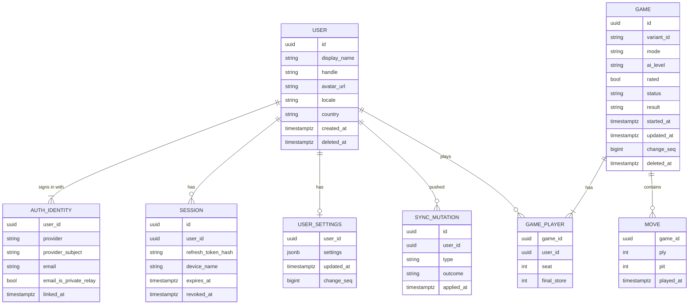

# Backend

> Design of `apps/server` (Rust): accounts in the MVP, real-time and async multiplayer later. **Status:** Accepted (stack). Details are Draft.

## Stack

- **Rust:** **Axum** for HTTP and WebSockets, **Tokio** runtime, **sqlx** for Postgres.
- **Postgres** for durable data (from the MVP).
- **Redis** for presence, matchmaking queues and pub/sub between instances (from multiplayer onwards).
- Uses `ouril-engine` directly to validate moves, and `ouril-protocol` for request and message types shared with every client.
- **Push notifications:** APNs (iOS), FCM (Android), Web Push (browsers).
- **Auth:** verifies Google and Apple ID tokens and issues our own sessions. See [accounts](../product/features/accounts.md).

## Scope by phase

| Phase | Server responsibilities |
|---|---|
| 1 · MVP | Sign in (Google, Apple), profile, account deletion, offline-first sync of game history and settings (guests never call the server) |
| 2 · More ways to play | No new server work (pass-and-play, variants and languages are on-device) |
| 3 · Async multiplayer | Async games (HTTP + push), invites, friends list |
| 4 · Live multiplayer | Live games (WebSocket + server clocks), matchmaking, rated games |
| 5 · Leaderboards | Glicko-2 ratings, points boards, scopes (global, country, region, city) |
| 6 · Community | More sign-in providers (X, Meta), tournaments |

## Data model (sketch)

- `AUTH_IDENTITY` is unique on `(provider, provider_subject)`. One user can link several providers.
- Email is **optional**. Apple may hide it behind a relay address, and X may not provide one at all.
- `GAME` holds **both** games vs AI (`mode = vs_ai`, one player, ID generated on the device) and online games, so there's one history.
- **Stats aren't stored as counters.** They're derived from `GAME` rows by the Rust core, and may be cached in a table that can be rebuilt.
- Synced tables carry `change_seq` (one Postgres sequence) and `deleted_at` for [offline sync](data-and-sync.md).

## API (sketch)

MVP:

| Method | Path | Purpose |
|---|---|---|
| `GET` | `/v1/meta` | Minimum supported and recommended app versions, API and protocol versions ([versioning](versioning.md)) |
| `POST` | `/v1/auth/dev` | **Debug builds only** (`dev-auth` feature): sign in as a seeded test user without Google or Apple ([ADR 0017](../decisions/0017-local-first-development.md)) |
| `POST` | `/v1/auth/google` | Exchange a Google ID token for our session |
| `POST` | `/v1/auth/apple` | Exchange an Apple identity token (+ first-time name) for our session |
| `POST` | `/v1/auth/refresh` | Rotate the refresh token, get a new access token |
| `POST` | `/v1/auth/logout` | Revoke the current session |
| `GET` / `PATCH` | `/v1/me` | Read and update the profile (display name, handle, avatar, locale) |
| `DELETE` | `/v1/me` | Delete the account (required by Apple and Google Play) |
| `POST` | `/v1/sync/push` | Upload queued local changes (game records, profile, settings). Repeats are ignored by mutation ID. |
| `GET` | `/v1/sync/pull?cursor=N` | Download the user's changes since cursor `N` |

Multiplayer adds `/v1/games…` (create, invite, async move) and the realtime WebSocket at `/v1/live`.

## Realtime protocol (sketch)

Client → server: `join(game_id)`, `move(game_id, ply, pit)`, `resign`, `offer_draw`, `accept_draw`.
Server → client: `state(game_id, moves, clocks)`, `moved(ply, pit, events, clocks)`, `game_over(result)`, `opponent_connection(status)`.

- Each move carries its **ply number**, so the server rejects stale or duplicate moves (idempotent).
- The server owns the clocks and timestamps every move.
- Clients apply their own move **optimistically** with the same engine. A rejection only happens if the client was tampered with.
- **Async** games use `POST /v1/games/{id}/moves` over HTTP. A background job enforces deadlines and sends push notifications.

## Operations

- **Hosting:** Fly.io, with `ouril-server-staging` and `ouril-server-prod`, managed Postgres in the same European region, migrations as the release command, at least 2 production machines, and secrets in `fly secrets` ([ADR 0019](../decisions/0019-host-server-on-fly-io.md)).
- Containerized, stateless app instances behind a load balancer. Live games are pinned to an instance, with Redis pub/sub for cross-instance events.
- Observability: structured logs (`tracing`), metrics, error tracking (for example Sentry).
- Secrets (Apple private key, push credentials) live in the host's secret manager, never in the repo.

## Open questions

- Data residency and GDPR requirements (EU diaspora players).
