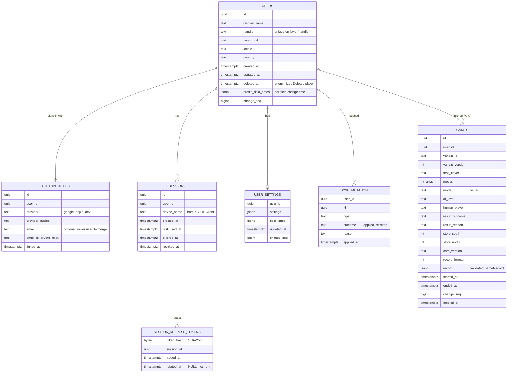
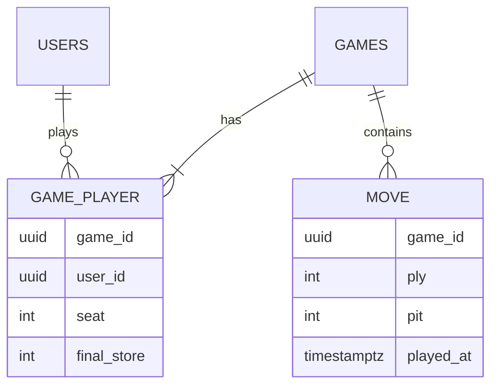

# Backend

> Design of `apps/server` (Rust): accounts and sync first (built, switched off for the web MVP, [ADR 0025](../decisions/0025-web-first-static-mvp.md)), real-time and async multiplayer later. **Status:** Accepted (stack). Details are Draft.

## Stack

- **Rust:** **Axum** for HTTP and WebSockets, **Tokio** runtime, **sqlx** for Postgres.
- **Postgres** for durable data (from the MVP).
- **Redis** for presence, matchmaking queues and pub/sub between instances (from multiplayer onwards).
- Uses `ouril-engine` directly to validate moves, and `ouril-protocol` for request and message types shared with every client.
- **Push notifications:** APNs (iOS), FCM (Android), Web Push (browsers).
- **Auth:** verifies Google and Apple ID tokens and issues our own sessions. See [accounts](../product/features/accounts.md).

## Scope by phase

| Phase | Server responsibilities |
|---|---|
| 1 · MVP | None: the web MVP is a static site. The accounts scope below is built and ships right after |
| Accounts (after the MVP) | Sign in (Google, Apple), profile, account deletion, offline-first sync of game history and settings (guests never call the server) |
| 2 · More ways to play | No new server work (pass-and-play, variants and languages are on-device) |
| 3 · Async multiplayer | Async games (HTTP + push), invites, friends list |
| 4 · Live multiplayer | Live games (WebSocket + server clocks), matchmaking, rated games |
| 5 · Leaderboards | Glicko-2 ratings, points boards, scopes (global, country, region, city) |
| 6 · Community | More sign-in providers (X, Meta), tournaments |

## Data model

The MVP schema is implemented in [`apps/server/migrations/20261004000001_init.sql`](../../apps/server/migrations/20261004000001_init.sql). Multiplayer will add `GAME_PLAYER` and `MOVE` tables, as sketched in the [Later](#later-multiplayer) diagram below.

- `AUTH_IDENTITIES` is unique on `(provider, provider_subject)`. One user can link several providers.
- Email is **optional**. Apple may hide it behind a relay address, and X may not provide one at all.
- **Refresh tokens rotate within a session.** Every token ever issued is kept as a SHA-256 hash in `SESSION_REFRESH_TOKENS`. Presenting a rotated one again revokes the whole session (reuse detection).
- **The profile is the `USERS` row**, which carries its own `change_seq`, so profile changes come down in pull.
- `GAMES` holds finished games vs AI in the MVP (`mode = vs_ai`, ID generated on the device). `record` is the exact `GameRecord` the client pushed, once the server has replayed it. Online games will reuse this table, so there's one history.
- **Stats aren't stored as counters.** They're derived from game records by `ouril-sync` (`derive_stats`), and may be cached in a table that can be rebuilt.
- Synced tables carry `change_seq` (one Postgres sequence, `change_seq`) for [offline sync](data-and-sync.md). `GAMES` also has `deleted_at` for deletion markers.
- **Account deletion** revokes every session and deletes identities, refresh tokens, settings, games and sync history. It turns the `USERS` row into an anonymized "Deleted player" (`deleted_at` set).

### Later: multiplayer

## API

The full contract is in [`apps/server/API.md`](../../apps/server/API.md): request and response shapes, errors, cookies and sync rules. MVP endpoints, all implemented:

| Method | Path | Purpose |
|---|---|---|
| `GET` | `/healthz` | Liveness check for Fly.io (`200 ok`, outside `/v1`) |
| `GET` | `/v1/meta` | Minimum supported and recommended app versions, API and protocol versions ([versioning](versioning.md)) |
| `POST` | `/v1/auth/dev` | **Debug builds only** (`dev-auth` feature): sign in as a test user without Google or Apple ([ADR 0017](../decisions/0017-local-first-development.md)). The user is found or created by name (default `dev`). |
| `POST` | `/v1/auth/google` | Exchange a Google ID token for our session. `501 not_configured` while `GOOGLE_CLIENT_ID` is empty. |
| `POST` | `/v1/auth/apple` | Exchange an Apple identity token (+ first-time name) for our session. `501 not_configured` while any `APPLE_*` is empty. |
| `POST` | `/v1/auth/refresh` | Rotate the refresh token, get a new access token |
| `POST` | `/v1/auth/logout` | Revoke the current session |
| `GET` / `PATCH` | `/v1/me` | Read and update the profile (display name, handle, avatar, locale, country) |
| `DELETE` | `/v1/me` | Delete the account (required by Apple and Google Play) |
| `POST` | `/v1/sync/push` | Upload queued local changes (game records, profile, settings, handle). Repeats are ignored by mutation ID. |
| `GET` | `/v1/sync/pull?cursor=N&limit=M` | Download the user's changes since cursor `N` |

Multiplayer adds `/v1/games…` (create, invite, async move) and the realtime WebSocket at `/v1/live`.

## As built (MVP)

- **Crate layout:** `apps/server` is a library plus a thin binary, so the integration tests build the same router. `ouril-server migrate` applies migrations (the Fly release command). Debug builds also apply them on startup.
- **Sessions:** the access token is a JWT (HS256, `JWT_SECRET`) with `sub`, `sid`, `iss = ouril`, `aud = ouril-api`, valid for 15 minutes by default. Every signed-in request also checks in the database that the session is live, so logout and deletion take effect at once. Refresh tokens are opaque, last 30 days by default, and each refresh extends the session.
- **Web vs native:** a request with an `Origin` from `ALLOWED_ORIGINS` is treated as the web app. The web app gets the refresh token as an httpOnly cookie, `ouril_refresh` (`SameSite=Lax`, `Path=/v1/auth`, `Secure` except on `http://localhost`), and never in the body. A disallowed `Origin` on `/v1/auth/*` gets 403. The web app holds a cross-tab lock (`navigator.locks`) while it refreshes, so two tabs don't trip reuse detection.
- **Google and Apple:** ID-token verification is written (cached key set, issuer, audience, expiry, nonce) and unit-tested offline with a test key. It hasn't been tested with real tokens. Revoking the Apple token on account deletion is still a TODO.
- **Sync validation:** `game_finished` records are replayed with `ouril-engine` at the exact `variant@version`. A record whose moves are illegal, or whose outcome, stores or end reason don't match, is rejected as `illegal_game`. Forfeits (format 2, reason `resigned`) must replay to a game still in progress, with the other side winning ([ADR 0022](../decisions/0022-forfeit-and-record-format-2.md)). Each mutation runs in its own transaction, and a repeated mutation ID returns the stored outcome.
- **Middleware:** `X-Ouril-Client` is parsed on every request, and clients below `min_supported` get `426` on every `/v1` route except `/v1/meta`. CORS allows exact origins with credentials. Other middleware: security headers (plus HSTS in release builds), a 1 MiB body limit, a 15 s timeout per request, JSON errors for every failure (including panics and malformed input), and request logs that never record headers or bodies.
- **Rate limiting:** in-memory fixed windows per server machine, keyed by client network (IPv4 address or IPv6 /64, from `Fly-Client-IP` behind Fly). Sign-in is limited to 60/min; everything else, including refresh and logout, to 600/min. Both are configurable. The map is capped at 50,000 windows and pruned at most every 10 s; when it's full, new clients pass untracked instead of being locked out. `429` comes with `Retry-After`. Counters move to Valkey when multiplayer brings it.
- **Release safety:** a release build with `dev-auth` fails to compile, and the production image never enables it. Release builds refuse to start with the `.env.example` JWT secret or a non-loopback `http://` origin.

## Realtime protocol (sketch)

Client → server: `join(game_id)`, `move(game_id, ply, pit)`, `resign`, `offer_draw`, `accept_draw`.
Server → client: `state(game_id, moves, clocks)`, `moved(ply, pit, events, clocks)`, `game_over(result)`, `opponent_connection(status)`.

- Each move carries its **ply number**, so the server rejects stale or duplicate moves (idempotent).
- The server owns the clocks and timestamps every move.
- Clients apply their own move **optimistically** with the same engine. A rejection only happens if the client was tampered with.
- **Async** games use `POST /v1/games/{id}/moves` over HTTP. A background job enforces deadlines and sends push notifications.

## Operations

- **Hosting:** Fly.io, with `ouril-server-staging` and `ouril-server-prod`, managed Postgres in the same European region, migrations as the release command, at least 2 production machines, and secrets in `fly secrets` ([ADR 0019](../decisions/0019-host-server-on-fly-io.md)).
- Containerized, stateless app instances behind a load balancer. Live games are pinned to an instance, with Redis pub/sub for cross-instance events.
- Observability: structured logs (`tracing`), metrics, error tracking (for example Sentry).
- Secrets (Apple private key, push credentials) live in the host's secret manager, never in the repo.

## Open questions

- Data residency and GDPR requirements (EU diaspora players).
