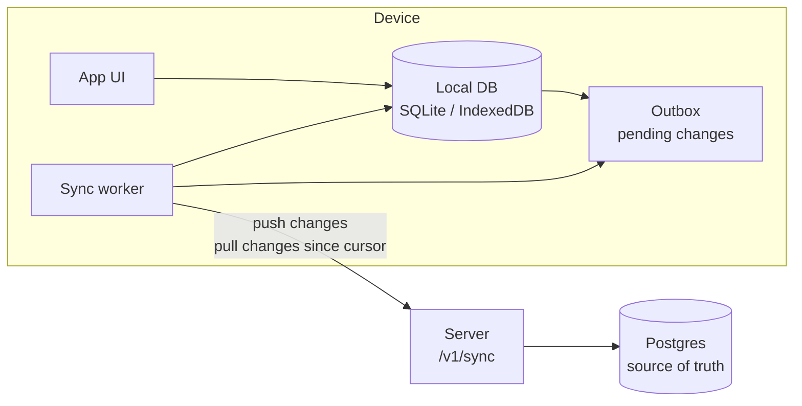

# Data storage and offline sync

> Where data lives, and how apps cache data locally and sync when the network is available. **Status:** Accepted. See [ADR 0010](../decisions/0010-postgres-and-local-sqlite.md) and [ADR 0011](../decisions/0011-offline-first-sync.md).

## Principles

- **Offline-first:** every app reads from and writes to its **local database**. The UI never waits for the network, except for live online games.
- **One shared online database** (Postgres) is the source of truth for identity and synced user data.
- **Sync when possible:** local changes queue up and upload when the network is available. Server changes download into the local cache.
- **Design data so conflicts are rare:** most data is append-only (finished games). Stats are *derived* from games rather than synced as counters.

## Where data lives

| Layer | Technology | Holds |
|---|---|---|
| **Server: primary** | **PostgreSQL** (Fly.io managed Postgres in production, [ADR 0019](../decisions/0019-host-server-on-fly-io.md); Docker locally) | Users, sign-in identities, sessions, profiles, settings, game records (vs AI and online), friends, ratings |
| **Server: cache and realtime** (multiplayer phases) | **Redis** or **Valkey** | Presence, matchmaking queues, pub/sub between instances, rate limits, and leaderboards later. Can be rebuilt from Postgres. |
| **iOS** | **SQLite** via GRDB | Local cache + outbox |
| **Android** | **SQLite** via Room | Local cache + outbox |
| **Web** | **IndexedDB** (via Dexie) | Local cache + outbox |
| **Secrets on device** | Keychain / Android Keystore / httpOnly cookie | Session tokens, never stored in the local DB |

## Data categories and how each syncs

| Data | Created | Sync strategy | Conflicts |
|---|---|---|---|
| **Finished games vs AI** | On device, offline | Append-only. The device generates the ID (UUIDv7). Upload once. | None: both sides keep every game (union by ID) |
| **Stats and streaks** | Derived | **Not synced as counters.** Computed from game records by the Rust core, on device and on the server. | None: the same games always give the same stats |
| **Profile** (display name, avatar) | Device or server | Field-level last-writer-wins (server timestamp) | The later edit wins |
| **Handle** | Device, needs the server | Queued as a *request*. Only applied once the server confirms it's unique. | Rejected if taken, and the user is prompted |
| **Settings** (sound, language, hints) | Device | Field-level last-writer-wins | The later edit wins |
| **Game in progress vs AI** | Device | **Stays on the device** (MVP) | n/a |
| **Async online moves** (Phase 3) | Device | Queued and submitted when online. The server validates the move (`ply` number + engine) | Rejected if stale, and the client refreshes the game |
| **Live online games** (Phase 4) | n/a | Need a connection, so no offline mode | n/a |

Deriving stats from games is the key choice. Counters edited offline on two devices would conflict ("wins = 10" vs "wins = 12"). A list of game records never conflicts. The derivation lives in the Rust core (`core/sync`), so every platform and the server compute identical numbers.

## Sync protocol

### Push (device → server)
- Each local change is written to the **outbox** in the same local transaction as the data change.
- `POST /v1/sync/push` sends a batch: `{ mutations: [{ id, type, payload, client_time }] }`.
- Every mutation has a unique `id`, so the server **ignores repeats**. Retrying after a timeout is always safe.
- The server replies per mutation with `applied` or `rejected(reason)`. Applied mutations are removed from the outbox. Rejected ones are rolled back locally and shown to the user if needed.

### Pull (server → device)
- Every synced row on the server gets a **change sequence number** that only goes up.
- `GET /v1/sync/pull?cursor=N` returns all of the user's changes after `N` (including deletion markers) and a new cursor.
- The device applies them to its local DB and stores the cursor.

### When sync runs
- When the app opens or returns to the foreground.
- When the network comes back (`NWPathMonitor` on iOS, `ConnectivityManager` on Android, the browser `online` event).
- Right after a game ends or a setting changes, debounced.
- Periodically in the background where allowed (`BGTaskScheduler` on iOS, `WorkManager` on Android).
- Failed syncs retry with exponential backoff.

## Guests and sign-in

- **Guests never need the network.** A guest makes no server calls at all, and no network requests unless they opted into telemetry ([ADR 0014](../decisions/0014-telemetry-consent.md)), and gameplay, tutorial, stats, history and settings all work in airplane mode. (On the web, the browser needs to load the site once; after that the installable PWA works offline.)
- Guests store everything locally under a random **guest ID**. The outbox fills up but is never uploaded.
- On sign-in, local records are **claimed** by the account, the outbox is pushed, and then a full pull merges data from the user's other devices.
- If a session expires while offline, the app keeps working locally. Uploads pause until the player signs in again.
- Signing out keeps local data but stops syncing. Signing in as a **different** account on the same device starts with an empty local cache. The previous user's unsynced data is kept aside, never merged into the wrong account.

## Server schema notes

- Each synced table has `user_id`, `updated_at`, `change_seq` (from a single Postgres sequence) and `deleted_at` (deletion marker).
- A `sync_mutation` table records applied mutation IDs, so repeats are ignored.
- Migrations are managed with `sqlx migrate` in `apps/server/migrations`.
- Local schemas carry a version number and run their own migrations on app start.

## Open questions

- Should a game in progress vs AI sync, so you can continue it on another device? This is post-MVP.
- History retention: keep every game vs AI forever, or summarize old ones?
