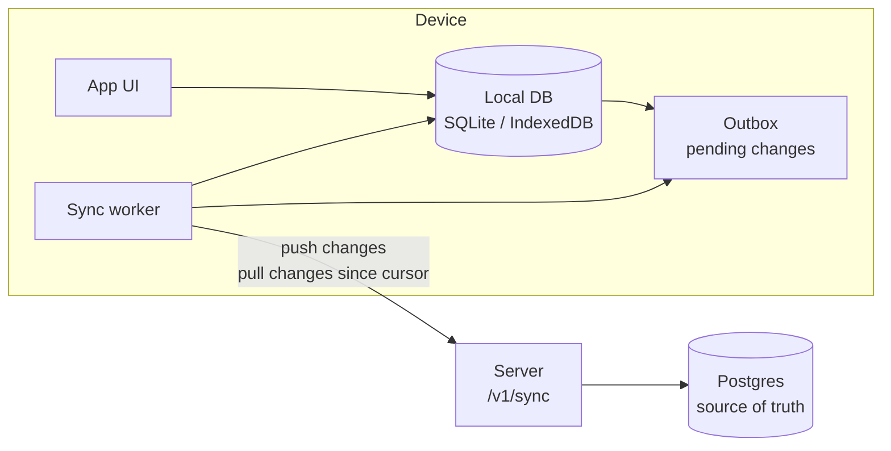

# Data storage and offline sync

> Where data lives, and how apps cache data locally and sync when the network is available. **Status:** Accepted. See [ADR 0010](../decisions/0010-postgres-and-local-sqlite.md) and [ADR 0011](../decisions/0011-offline-first-sync.md).

## Principles

- **Offline-first:** every app reads from and writes to its **local database**. The UI never waits for the network, except for live online games.
- **One shared online database** (Postgres) is the source of truth for identity and synced user data.
- **Sync when possible:** local changes queue up and upload when the network is available. Server changes download into the local cache.
- **Design data so conflicts are rare:** most data is append-only (finished games). Stats are *derived* from games rather than synced as counters.

## Where data lives

| Layer | Technology | Holds |
|---|---|---|
| **Server: primary** | **PostgreSQL** (Fly.io managed Postgres in production, [ADR 0019](../decisions/0019-host-server-on-fly-io.md); Docker locally) | Users, sign-in identities, sessions, profiles, settings, game records (vs AI and online), friends, ratings |
| **Server: cache and realtime** (multiplayer phases) | **Redis** or **Valkey** | Presence, matchmaking queues, pub/sub between instances, rate limits, and leaderboards later. Can be rebuilt from Postgres. |
| **iOS** | **SQLite** via GRDB | Local cache + outbox |
| **Android** | **SQLite** via Room | Local cache + outbox |
| **Web** | **IndexedDB** (via Dexie) | Local cache + outbox |
| **Secrets on device** | Keychain / Android Keystore / httpOnly cookie | Session tokens, never stored in the local DB |

## Data categories and how each syncs

| Data | Created | Sync strategy | Conflicts |
|---|---|---|---|
| **Finished games vs AI** | On device, offline | Append-only. The device generates the ID (UUIDv7). Upload once. | None: both sides keep every game (union by ID) |
| **Stats and streaks** | Derived | **Not synced as counters.** Computed from game records by the Rust core, on device and on the server. | None: the same games always give the same stats |
| **Profile** (display name, avatar, locale, country, handle) | Device or server | Field-level last-writer-wins by **change time**: the device's `client_time` (clamped to the server's clock) for synced changes, server time for direct edits (`PATCH /v1/me`). The server stores each field's time, so a change delivered late never overwrites a newer one | The edit made later wins, whatever order they arrive in |
| **Handle** | Device, needs the server | Queued as a *request*. Only applied once the server confirms it's unique. | Rejected if taken, and the user is prompted |
| **Settings** (sound, language, hints) | Device | Field-level last-writer-wins by **device time** (`client_time`, clamped to the server's clock). The server stores each field's time, so a change delivered late (offline, or deferred) never overwrites a newer one | The edit made later wins, whatever order they arrive in |
| **Game in progress vs AI** | Device | **Stays on the device** (MVP) | n/a |
| **Async online moves** (Phase 4) | Device | Queued and submitted when online. The server validates the move (`ply` number + engine) | Rejected if stale, and the client refreshes the game |
| **Live online games** (Phase 6) | n/a | Need a connection, so no offline mode | n/a |

Deriving stats from games is the key choice. Counters edited offline on two devices would conflict ("wins = 10" vs "wins = 12"). A list of game records never conflicts. The derivation lives in the Rust core (`core/sync`), so every platform and the server compute identical numbers.

## Sync protocol

### Push (device → server)
- Each local change is written to the **outbox** in the same local transaction as the data change.
- `POST /v1/sync/push` sends a batch: `{ mutations: [{ id, type, payload, client_time }] }`.
- Every mutation has a unique `id`, so the server **ignores repeats**. Retrying after a timeout is always safe.
- The server replies per mutation with `applied`, `rejected(reason)` or `deferred(reason)`. Applied mutations are removed from the outbox. Rejected ones are permanent: they're rolled back locally and shown to the user if needed. **Deferred** ones are mutations the server can't process yet, typically from an app newer than the server (an unknown variant version, a newer record format or mutation type). They stay in the outbox, are skipped for the rest of that sync so they don't block the mutations behind them, and are pushed again on later syncs. Unknown statuses are treated like `deferred`.

### Pull (server → device)
- Every synced row on the server gets a **change sequence number** that only goes up.
- `GET /v1/sync/pull?cursor=N` returns all of the user's changes after `N` (including deletion markers) and a new cursor.
- The device applies them to its local DB and stores the cursor.

### When sync runs
- When the app opens or returns to the foreground.
- When the network comes back (`NWPathMonitor` on iOS, `ConnectivityManager` on Android, the browser `online` event).
- Right after a game ends or a setting changes, debounced.
- Periodically in the background where allowed (`BGTaskScheduler` on iOS, `WorkManager` on Android).
- Failed syncs retry with exponential backoff.

## Guests and sign-in

- **Guests never need the network.** A guest makes no server calls at all, and no network requests unless they opted into telemetry ([ADR 0014](../decisions/0014-telemetry-consent.md)), and gameplay, tutorial, stats, history and settings all work in airplane mode. (On the web, the browser needs to load the site once; after that the installable PWA works offline.)
- Guests store everything locally under a random **guest ID**. The outbox fills up but is never uploaded.
- On sign-in, local records are **claimed** by the account, the outbox is pushed, and then a full pull merges data from the user's other devices. This includes the guest's queued settings changes: they upload like games, and the usual field-level last-writer-wins applies against the account's settings from other devices. The guest's settings and in-progress game move to the account, unless this device already holds the account's own copies.
- If a session expires while offline, the app keeps working locally. Uploads pause until the player signs in again.
- Signing out keeps local data but stops syncing. Signing in as a **different** account on the same device starts with an empty local cache. The previous user's unsynced data is kept aside, never merged into the wrong account.

## Server schema notes

- Each synced row has `change_seq`, taken from a single Postgres sequence (`change_seq`). Synced data lives in `games` (with `deleted_at` for deletion markers), `user_settings`, and the profile on the `users` row itself. The full schema is in [backend](backend.md#data-model).
- A `sync_mutation` table, keyed by `(user_id, id)`, records every mutation ID with its outcome (`applied`, or `rejected` with a reason), so a repeat returns the first outcome without changing anything. Deferrals are never recorded, so the same ID can be applied after a server update.
- Migrations are managed with `sqlx migrate` in `apps/server/migrations`. Debug builds apply them on startup, and release builds use `ouril-server migrate`.
- Local schemas carry a version number and run their own migrations on app start.

## As built

### Server (`apps/server`)
- **Push** takes at most 100 mutations (`413` otherwise) and applies each in its own transaction, in request order. Mutation types, all at schema 1: `game_finished`, `profile_updated`, `settings_updated` and `handle_requested`. Rejection reasons: `invalid_payload`, `unknown_type`, `unsupported_schema`, `illegal_game` and `handle_taken`.
- **`game_finished`** is checked by replaying the moves with `ouril-engine` at the recorded `variant@version`. A forfeit (format 2, [ADR 0022](../decisions/0022-forfeit-and-record-format-2.md)) must replay to a game still in progress, and the side that didn't resign wins. Union by game ID: a game pushed again under a new mutation ID is still stored once, and a game ID owned by another account is `invalid_payload`.
- **Pull** returns changes in `change_seq` order for three entities, `game`, `profile` and `settings`. `limit` is 1–500 (default 200), and `has_more` tells the client to pull again right away.
- Contract: [server API](../../apps/server/API.md#endpoints).

### Web (`apps/web`)
- **Local database:** IndexedDB via Dexie, schema version 1. Tables: `games` (finished games), `outbox` (pending mutations, UUIDv7 IDs so they upload in creation order) and `kv` (settings, telemetry consent, the guest ID, the active owner and signed-in account, sync cursors per owner, and the game in progress).
- **Owners:** every `games` and `outbox` row carries an `owner`: the guest ID (`guest:<uuidv7>`) or the user ID. A finished game and its `game_finished` mutation are written in one transaction. Settings changes queue `settings_updated`. Telemetry choices are never synced.
- **Sign-in:** guest rows are relabelled to the user (claimed), and the guest's outbox is uploaded. If a different user then signs in, the app switches to that user's empty view and leaves the previous user's rows aside, untouched.
- **Sync engine:** runs only while signed in. It pushes the outbox in batches of 100, then pulls by cursor and ignores unknown entities. It runs on start, on the `online` event, on return to the foreground, debounced after a local change, and every 5 minutes, with exponential backoff.
- **Rejections:** a rejected mutation is removed from the outbox. A rejected game stays in local history, marked so the Stats screen can show "Not backed up". It isn't rolled back (see Open questions).
- **Tokens:** the access token is kept in memory only, and the refresh token in the httpOnly cookie. A `401` triggers one refresh and a retry. If the refresh fails, the app shows the session as expired and keeps working locally.
- **Guests:** the sync engine is never created, and a test replaces `fetch`, `XMLHttpRequest`, `WebSocket`, `EventSource` and `sendBeacon` with spies to check that a full guest session makes no requests.

## Open questions

- Should a game in progress vs AI sync, so you can continue it on another device? This is post-MVP.
- History retention: keep every game vs AI forever, or summarize old ones?
- Rejected game records: the web app keeps them in local history, marked "Not backed up", instead of rolling them back as [Push](#push-device--server) describes. A rejected game was illegal or tampered with, so should it still count in local stats?
- Pull ordering under concurrent pushes: `change_seq` is taken at write time, not commit time, so a pull can skip a row from a transaction that commits late ([server API, open questions](../../apps/server/API.md#open-questions)).
