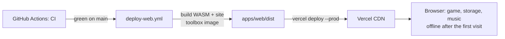

# Deployment

> How the MVP web app is built and deployed, and what changes when the server ships. **Status:** Accepted. See [ADR 0025](../decisions/0025-web-first-static-mvp.md).

## The MVP: a static site

The MVP is the web app alone. Its build (`apps/web/dist`) is a static site: HTML, JavaScript, the WASM rules engine, the 3D board, fonts, images and music. It needs **no server and no database**.

- **Why it's built in GitHub Actions:** the WASM engine is compiled from Rust, and Vercel's build image has no Rust toolchain. [`.github/workflows/deploy-web.yml`](../../.github/workflows/deploy-web.yml) runs after CI passes on `main` (or by hand). It builds the WASM engine and the site with the same toolbox image as CI ([ADR 0017](../decisions/0017-local-first-development.md)), copies `apps/web/vercel.json` into the build, and uploads it with `vercel deploy --prod`.
- **`vercel.json`** turns off Vercel's own Git deployments (`git.deploymentEnabled: false`): a build on Vercel fails because `ouril-wasm` (`core/wasm/pkg`) can't be compiled there. It also carries the SPA routing (every path except assets, icons, audio and the service worker serves `index.html`), the security headers (HSTS, CSP with `connect-src` limited to the site and the Matomo host, etc.) and a 404 for missing `/audio/` files.
- **Environment variables:** only usage statistics ([ADR 0026](../decisions/0026-usage-statistics-with-matomo.md)). The workflow builds with `VITE_MATOMO_URL=https://analytics.moreiralabs.org/` and `VITE_MATOMO_SITE_ID=1` (repository variables of the same name override them), and the CSP's `connect-src` allows that host; a different host needs both changed. Players are asked on first launch and nothing is sent without consent. Sign-in and Stats are off by default (`VITE_FEATURE_ACCOUNTS`, `VITE_FEATURE_STATS`), and with no `VITE_SENTRY_DSN` crash reports aren't offered. Local builds set none of these, so development sends nothing.
- **Offline:** the service worker precaches the app (about 2 MB) and downloads the game music into its own cache while the browser is idle ([web design](web-design.md)).

## One-time setup

1. Create a Vercel project for the repository with **Framework: Other**, **no build command** and **output directory `.`** (the uploaded folder is already the built site).
2. Add the repository secrets **`VERCEL_TOKEN`**, **`VERCEL_ORG_ID`** and **`VERCEL_PROJECT_ID`** (GitHub → Settings → Secrets and variables → Actions). Until `VERCEL_TOKEN` exists, the workflow skips the deploy.
3. Point the domain at the Vercel project. HTTPS is automatic, and required for the service worker and installing the app.
4. In Matomo (site 1), keep the privacy settings ADR 0026 relies on: **Anonymize IP addresses** (at least 2 bytes, also used for location), **no location from IP** (or the anonymized IP only), and a data-retention period. Add the production domain to the site's URLs.

## Releasing

Merge to `main`. CI runs; when it's green, `deploy-web.yml` deploys that exact commit to production. A failed CI run never deploys. Players get the new version on their next visit (the service worker updates itself, `registerType: autoUpdate`).

## When the server ships

Turning on accounts and sync ([ADR 0009](../decisions/0009-oauth-accounts-google-apple.md)) adds the Rust server and Postgres on Fly.io ([ADR 0019](../decisions/0019-host-server-on-fly-io.md)), on the same site as the web app ([ADR 0020](../decisions/0020-web-and-api-on-one-site.md)). That release also:

- builds the web app with `VITE_FEATURE_ACCOUNTS=true` (and `VITE_FEATURE_STATS=true`) and `VITE_API_BASE_URL=https://api.<domain>`;
- adds the API origin to the CSP `connect-src` in `vercel.json`;
- sets the provider keys (Google, Apple) and `ALLOWED_ORIGINS` on the server;
- publishes the privacy policy and the account-deletion page.

## Open questions

- The production domain.
