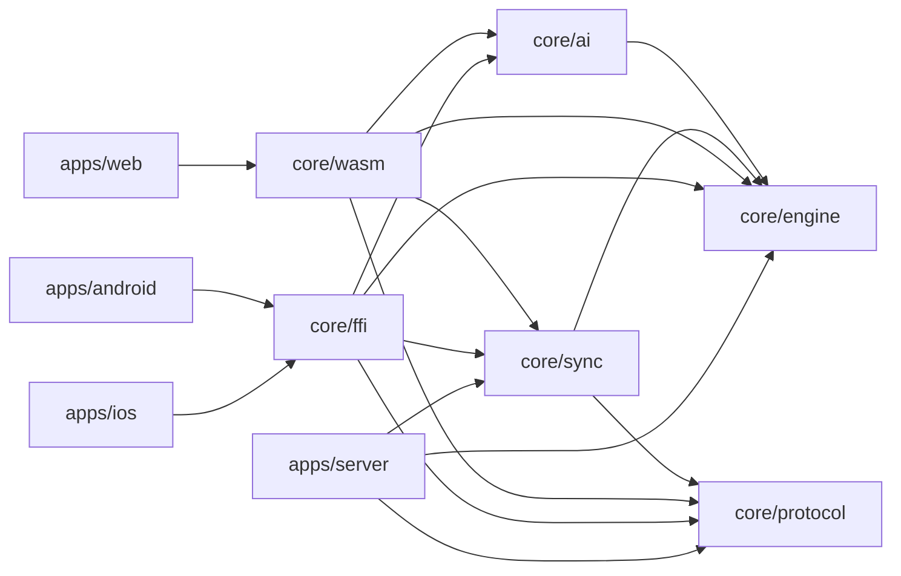

# Monorepo layout

> Folder structure, tooling and boundaries. **Status:** Accepted. See [ADR 0007](../decisions/0007-rust-core-with-generated-bindings.md) and [ADR 0008](../decisions/0008-native-apps-per-platform.md).

## Layout

```
ouril/
├── core/                   # Rust workspace members shared by every platform
│   ├── engine/             # ouril-engine: rules + variants/*.toml (base.oware, cv.standard)  ✅ built
│   ├── ai/                 # ouril-ai: computer opponent                                     ✅ built
│   ├── protocol/           # ouril-protocol: API types (auth, me, sync); realtime later       ✅ built
│   ├── sync/               # ouril-sync: GameRecord, mutation payloads, derive_stats           ✅ built
│   ├── ffi/                # UniFFI bindings → Swift + Kotlin                                 (not started)
│   ├── wasm/               # wasm-bindgen bindings → core/wasm/pkg (gitignored); API.md       ✅ built
│   └── test-vectors/       # language-neutral JSON rule tests + schema/test-vector.schema.json
├── apps/
│   ├── ios/                # SwiftUI app (Xcode); uses the core as an XCFramework via SPM     (not started)
│   ├── android/            # Kotlin + Jetpack Compose (Gradle); core .so + Kotlin bindings     (not started)
│   ├── web/                # TypeScript + React (Vite, PWA); uses core/wasm/pkg                ✅ built
│   │   ├── vercel.json     # SPA routing + CSP and security headers for Vercel (ADR 0020)
│   │   └── scripts/gen-i18n.mjs  # interim: shared/i18n → src/generated/i18n (until tools/i18n-gen)
│   └── server/             # Rust (Axum): auth + accounts + sync; API.md, migrations/,        ✅ built
│                           #   Dockerfile (production) + fly.toml (ADR 0019)
├── tools/
│   └── i18n-gen/           # Rust CLI: shared/i18n → .xcstrings, strings.xml, i18next JSON (ADR 0016; not started)
├── shared/
│   ├── i18n/               # source translations (ICU messages in JSON) → generated per-platform files
│   └── assets/             # board/seed art, sounds, icons (not created yet)
├── docs/                   # this documentation
├── .github/workflows/ci.yml # CI: docs + vectors, Rust (fmt, clippy, tests, audit), WASM + web, release image
├── docker/                 # toolbox.Dockerfile (Rust, wasm-pack, binaryen/wasm-opt, sqlx, cargo-watch, just, Node + pnpm),
│                           #   server.dev.Dockerfile, web.dev.Dockerfile, compose.lan.yaml (ADR 0017)
├── .devcontainer/          # Dev Container using the toolbox image
├── compose.yaml            # local stack: db (Postgres 18), server, web, toolbox (profile `tools`); later valkey
├── .env.example            # server config template; copy to .env (never committed)
├── Cargo.toml              # Rust workspace root (core/* + apps/server; tools/* later)
├── rust-toolchain.toml     # Rust toolchain: stable channel, rustfmt, clippy, wasm32 target
├── justfile                # task runner: dev, test, test-core, test-server, test-web, bindings, lint, …
├── package.json            # root of the pnpm workspace
└── pnpm-workspace.yaml     # web tooling: apps/web + core/wasm/pkg (the generated `ouril-wasm` package)
```

## Tooling

| Area | Tools |
|---|---|
| Rust | Cargo workspace, `clippy`, `rustfmt`, `cargo test`, `proptest` for property tests, `jsonschema` (test vectors), `ts-rs` (TypeScript types, `ts` feature) |
| Bindings | **UniFFI** (Swift and Kotlin), `cargo-ndk` (Android ABIs), XCFramework packaging for iOS, **wasm-bindgen**/`wasm-pack` (web) |
| iOS | Xcode, Swift Package Manager, SwiftUI, GRDB (SQLite), XCTest |
| Android | Gradle, Kotlin, Jetpack Compose, Room (SQLite), WorkManager, JUnit |
| Web | pnpm, Vite, React, React Router, TypeScript (strict), Dexie (IndexedDB), i18next + ICU, vite-plugin-pwa, Vitest + Testing Library, ESLint, Prettier |
| Server | Axum, Tokio, tower-http, sqlx (Postgres, `sqlx migrate`), jsonwebtoken, reqwest (provider key sets), tracing. Redis client later |
| Local environment | **Docker Compose** (`compose.yaml`): `db`, `server`, `web`, `toolbox`. Only Xcode, the iOS Simulator and the Android Emulator run on the host ([ADR 0017](../decisions/0017-local-first-development.md)) |
| Tasks | `just`: wraps `docker compose` and runs the same recipes locally and in CI. Inside the toolbox (`OURIL_IN_TOOLBOX=1`) the recipes run commands directly. Commands: [CLAUDE.md](../../CLAUDE.md#commands) and [CONTRIBUTING.md](../../CONTRIBUTING.md#local-setup-docker-first) |
| CI | GitHub Actions, using the same `toolbox` image as local development: Rust tests and lints on Linux; iOS build on macOS runners; Android and web builds; test vectors on every platform |
| Releases | fastlane (or Xcode Cloud) for App Store; Gradle Play Publisher for Google Play; static hosting + CDN for web |

## Dependency rules



As built: `core/protocol` depends on no other crate (only serde). `core/sync` depends on `engine` and `protocol`, because `GameRecord` uses engine types. `core/ffi`, `apps/ios` and `apps/android` don't exist yet.

- `core/*` crates are **pure**: no I/O, no networking, no storage, no platform APIs.
- Apps never call the engine directly. They go through the generated bindings (`ffi` or `wasm`).
- Apps never import from each other. Shared logic belongs in `core/`, and shared resources in `shared/`.
- **Networking, sign-in and storage are native** in each app, using platform SDKs.

## Conventions

- Rust crates are prefixed `ouril-` (`ouril-engine`, `ouril-ai`, …).
- Generated bindings and generated string files are **build output**: gitignored, regenerated with `just bindings` / `just i18n`, never hand-edited ([ADR 0015](../decisions/0015-generated-bindings-not-committed.md)).
- Commits: [Conventional Commits](https://www.conventionalcommits.org/) (`feat(engine): …`, `fix(ios): …`).
- Branches: `main` is always releasable. Feature branches merge through PRs.

## Open questions

- Should a marketing/landing site live in `apps/site`, or be part of `apps/web`?
