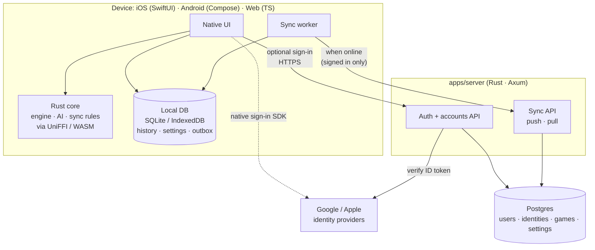
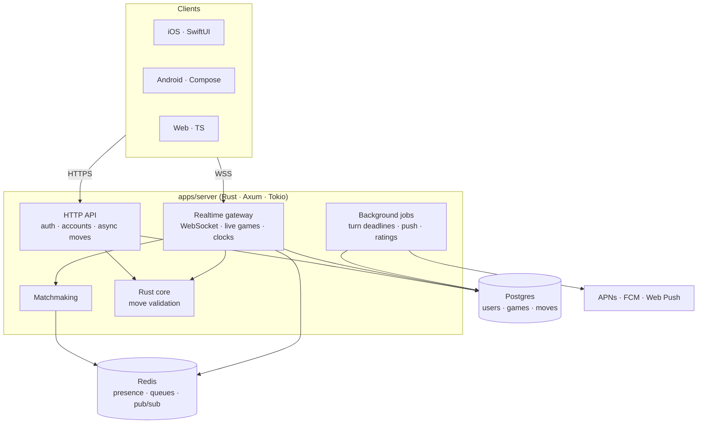

# Architecture overview

> The main building blocks of Ouril and how they fit together. **Status:** Accepted

## Summary

- A **shared Rust core** holds the rules engine, the AI and the protocol types. It is compiled into every app and into the server ([ADR 0007](../decisions/0007-rust-core-with-generated-bindings.md)).
- **Native apps:** SwiftUI on iOS, Jetpack Compose on Android, and a TypeScript web app ([ADR 0008](../decisions/0008-native-apps-per-platform.md)).
- The rules engine is **variant-configurable** ([ADR 0004](../decisions/0004-variant-configurable-rules-engine.md)).
- **Accounts** use Google and Apple sign-in from the MVP. Signing in is optional ([ADR 0009](../decisions/0009-oauth-accounts-google-apple.md)).
- A **server-authoritative Rust backend** handles accounts (MVP), then real-time and async multiplayer ([ADR 0005](../decisions/0005-server-authoritative-multiplayer.md)).

## MVP (Phase 1)

- **Gameplay is entirely on-device and works offline.** The rules engine and AI run inside the app.
- **Guests never use the network** (except opt-in telemetry, [ADR 0014](../decisions/0014-telemetry-consent.md)). Signed-in players work offline too. Changes queue locally and sync when the network is available ([data and sync](data-and-sync.md)).

## Target (multiplayer)

## Key properties

| Concern | Approach |
|---|---|
| Rule correctness | One Rust engine, used everywhere. Shared JSON test vectors run on every platform. |
| Cheating | The server validates every online move with the same core and owns the clocks |
| Offline | Single-player is fully on-device. Online features degrade gracefully. |
| Responsive online play | Clients apply moves optimistically. The server and client run identical logic, so they agree. |
| Variants | Data-driven config, so no per-variant forks |
| Development | Local-first and Docker-first: `compose.yaml` runs Postgres, the server, the web dev server and the toolchains; only Xcode, the iOS Simulator and the Android Emulator run on the host; dev sign-in ([ADR 0017](../decisions/0017-local-first-development.md)). Build order core → web → iOS → Android, launch together ([ADR 0018](../decisions/0018-platform-build-order.md)). |
| Identity | Our own user IDs. Providers (Google, Apple; later X and Meta) are linked identities. |
| Hosting | Server and Postgres on **Fly.io**, with staging and production apps ([ADR 0019](../decisions/0019-host-server-on-fly-io.md)). Web app on Vercel (candidate). |
| Data | Postgres online (source of truth), SQLite / IndexedDB on device. Offline-first outbox + cursor sync ([ADR 0010](../decisions/0010-postgres-and-local-sqlite.md), [ADR 0011](../decisions/0011-offline-first-sync.md)). |

Details: [monorepo](monorepo.md) · [engine](engine.md) · [AI](ai.md) · [data and sync](data-and-sync.md) · [backend](backend.md) · [accounts](../product/features/accounts.md)

## Open questions

- Web hosting is still a candidate, not a decision. The server is decided: **Fly.io** with managed Postgres in one European region ([ADR 0019](../decisions/0019-host-server-on-fly-io.md)).
  - **Web app: Vercel.** The Vite build is static. CI builds it with the `toolbox` image, which includes Rust for the WASM engine, and uploads it with `vercel deploy --prebuilt`, so Vercel needs no Rust. A rewrite serves `index.html` for every route, and a rewrite forwarding `/v1/*` to the API keeps one origin for the session cookie and Sign in with Apple. WebSocket traffic for live multiplayer can't go through that rewrite, so it connects to the API host directly.
