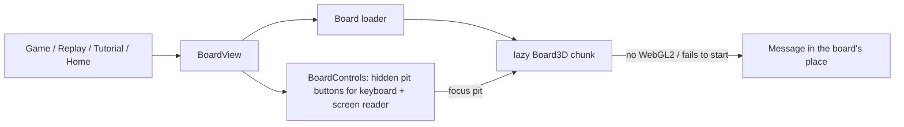

# Web design

> The web app's visual design system ("Mesa"), its motion rules and the 3D board. **Status:** Draft

The source of truth is the code: tokens and components in `apps/web/src/styles.css`, the 3D board in `apps/web/src/board3d/`. This page explains the intent so changes stay consistent. The board technology is decided in [ADR 0021](../decisions/0021-3d-web-board.md).

## Look and feel

The direction is a warm table in Cape Verde: sand, volcanic basalt, terracotta and the Atlantic.

| Token | Light | Use |
|---|---|---|
| `--bg` / `--surface` | sand `#f4ede2` / `#fffcf7` | Page and cards |
| `--ink` | basalt `#1f1915` | Text |
| `--brand` | terracotta `#b9532a` | Primary buttons, accents, the logo |
| `--sea` | Atlantic teal `#0f6b75` | Secondary accent, keyboard focus on the board |
| `--gold` | `#e6a63a` | Playable pits, sowing |
| `--table-1/2` | dark wood | The stage behind the board |

- **Dark mode** follows the system (`prefers-color-scheme`) and redefines the same tokens. `index.html` sets a matching `theme-color` for each scheme.
- **Type:** *Fraunces* (display, headings) and *Manrope* (UI). Both are variable fonts, **self-hosted** through `@fontsource-variable` packages. No font CDN.
- **Icons:** inline SVG in `components/Icons.tsx`, always `aria-hidden`, next to visible text.
- **Layout:**
  - On desktop, a sticky header holds the logo, the navigation and the account link.
  - On phones (≤ 760 px) the navigation becomes a bottom tab bar. The header has no `backdrop-filter` on phones, because that would trap the fixed tab bar inside the header.

## Motion rules

The rules come from the `emil-design-eng`, `emilkowalski-motion` and `review-animations` skills. Every animation must follow them; run `/review-animations` on changes.

- **Purpose first.** Animate to explain a change (seeds moving, a capture), to confirm an action (a press), or to orient (a dialog opening). Never as decoration, and no endless loops.
- **Frequency.** The more often something happens, the less it animates.
  - Navigation between pages doesn't animate.
  - The home hero reveal plays once per session.
  - Keyboard-driven changes are instant.
- **Properties.** Movement uses only `transform` and `opacity`, never layout properties. Colour, border and shadow may cross-fade on state changes. Always list properties; never use `transition: all`.
- **Durations.** UI motion stays at or under 300 ms (`--dur-press` 160 ms, `--dur-fast` 180 ms, `--dur-base` 240 ms). Seed flights follow the game's animation speed setting.
- **Easing:**
  - entering and exiting use `--ease-out: cubic-bezier(0.23, 1, 0.32, 1)`
  - movement on screen uses `--ease-in-out: cubic-bezier(0.77, 0, 0.175, 1)`
  - never use `ease-in` for UI
- **Press feedback.** Pressable elements scale to `0.97` on `:active`.
- **Hover.** Hover effects apply only under `(hover: hover) and (pointer: fine)`, so touch devices don't get sticky hovers.
- **Enter from somewhere.** Nothing appears from `scale(0)`. Dialogs start at `scale(0.96)` and `opacity: 0`, using `@starting-style`.
- **Reduced motion.** Keep fades and drop movement. In the 3D board, seeds snap into place and the camera stays still; highlight glows still fade.

## The 3D board

`components/BoardView.tsx` shows the board, and `board3d/` draws it.

- **Scene:**
  - The board is an extruded slab with holes, plus lathe-turned bowls and stores.
  - The wood is a procedural canvas texture (`board3d/textures.ts`).
  - Lighting uses local `Lightformer`s, plus contact shadows rendered once.
- **Seeds:**
  - All 48 seeds are one `InstancedMesh` with per-seed colour variation.
  - `board3d/seeds.ts` reconciles each display frame: it moves the fewest seeds between containers (pits, stores and the "hand").
- **The hand** (`board3d/Sowing.tsx`) plays every move the way a person does. It's procedural (capsules and a rounded palm, a right hand with a blue sleeve), so nothing is downloaded. It reaches in from the mover's side of the table: from the camera side for you, from the far side for the computer.
  - *pickup:* it reaches into the pit, closes around the seeds and lifts them;
  - *sow:* it glides to the next pit (first half of the frame) and lets one seed fall; the seed drops with an accelerating fall and a small bounce, and the rest stay in its grip;
  - *skip:* it passes over the origin pit;
  - *capture:* it dips into the captured pit, grabs the seeds, carries them to the store and opens to drop them in;
  - *end of the move:* it withdraws off the table.
  - Collecting the remaining seeds at the end of a game, undo and resume move the seeds on an arc instead.
  - The hand follows a small keyframe track rebuilt on each display frame, starting from where it is, so it never jumps.
  - Timing: move frames play 2.2× slower on the 3D board (`PACE_3D` in `board3d/pace.ts`). Pickup and capture frames are longer than a single seed drop (`game/animation.ts`), so the grab and the carry are easy to follow.
  - All per-frame motion uses the scene clock (`board3d/clock.ts`), so it's frame-rate independent. With reduced motion there's no hand and the seeds snap into place.
- **Store counts** pop when seeds arrive.
- **Glow rings** show the game state:
  - playable pits: gold
  - hover: brighter gold
  - keyboard focus: teal
  - hint: blue
  - sowing: gold pulse
  - capture: red
  - Rings rise quickly and fade slowly.
- **Camera:**
  - A fixed, angled view fitted to the screen's aspect ratio (steeper on narrow phones). There's no free orbit.
  - It pushes in gently on captures and lifts at the end of the game.
- **Seed counts** are DOM chips positioned over the canvas each frame. Text stays crisp and theme-aware.
- **Performance:**
  - `frameloop="demand"` (draws only while something moves)
  - pixel ratio capped at 1.75
  - one draw call for all seeds

## Loading the 3D board

The 3D board is a separate chunk, so it isn't there on the first paint. `BoardView` shows a small **loading widget** in its place: three ouri seeds dropping one after another into a wooden bowl, with "Loading the board…". It's deliberately not board-shaped. The 3D board fades in over it once it has really drawn (two rendered frames).
- Keyboard and screen-reader play work at once through `BoardControls` (visually hidden pit buttons; the hinted pit is announced as the suggested move).
- If the 3D board can't run (no WebGL2) or fails to start, the board area says so (with **Try again** for a failure).
- With reduced motion the loader's seeds are still.

## The game screen

- **Rules choice:** the new-game form offers **Standard** (`cv.standard`), **Continuous sowing** (`cv.continuous`, [ADR 0023](../decisions/0023-relay-sowing.md)), **Capture across** (`cv.across`) and **Capture across + continuous** (`cv.across-continuous`, [ADR 0024](../decisions/0024-capture-across.md)); *Play again* keeps the same rules. A relay shows as another pickup: the hand reaches back into the pit and grabs its seeds. The Rules page has a tab for it. The tutorial ends with two continuous-sowing lessons and a capture-across lesson (each tutorial step names the rules it's played with, `tutorial/steps.ts`).
- **Rules:** the Rules page has one tab per playable variant (`?variant=<id>` links a tab) and shows each topic as a collapsible section (native `
`), so new variants don't make the page longer. A regional variant lists only its differences and links to the rules it's based on. In a game, the **info button** in the top bar opens the rules of the variant being played (`components/RulesView.tsx`, content in `content/rules.ts`).
- **No game in progress:** the game screen is the **New game** form itself (difficulty, who starts, then **Start game**), the same form as on the landing page (`components/NewGameForm.tsx`), in the usual layout with navigation.
- **Full screen:** while a game is on screen it takes the whole viewport (`state/immersive.ts`). There's no header or tab bar; a top bar holds a Home button, the scores and a full-screen button. The full-screen button uses the Fullscreen API where the browser allows it on page elements; iPhone Safari doesn't, so there the full-viewport layout is the full screen.
- **Game menu:** the pause button (top bar) and **Menu** open it: *Keep playing*, *Save and exit* (the game is saved after every move and resumes from the home screen, where the hero's main button becomes *Continue your game*), or *Forfeit game*, after a confirmation. The home page's resume card offers the same **Forfeit game**, with the same confirmation (`game/forfeit.ts` is shared), and starting a new game while one is unfinished forfeits it (the form warns first; this applies even to a game with no moves yet). A forfeit is a loss and is recorded like any game ([ADR 0022](../decisions/0022-forfeit-and-record-format-2.md)).
- **Score feedback:** when seeds are captured, the score pops (280 ms) and a "+N" rises from it. The number itself changes at once, so it's never behind the game.
- **End of game:** the result dialog has an emblem, a short tagline and the final score counting up once. The design follows common practice for victory and defeat screens:
  - only a **win** celebrates: a warm header band, a gold star and a short burst of confetti in the flag's colours, led by its ten yellow stars and with a few grey ouris among them;
  - a **loss** is calm and darker, with no confetti, and its main button says **Rematch**;
  - a **draw** is teal.
  - Everything is skipped with reduced motion.

## The landing page

- **Hero:** full-bleed, in the islands' colours (Atlantic blues, a sunset glow) with the flag's ring of ten stars. It has the big *Ouril* title, two calls to action (**Play now**, **Learn to play**), and a **live board**: the computer playing itself with the hand, so the page shows how the game works.
  - The live board plays only while it's on screen. It stops after ten moves (no endless loop) and stays still with reduced motion.
  - The reveal (copy, stars, board) plays once per session.
- **Sections:** quick start (difficulty and who starts), *How to play* in four steps, *Ten islands, one board* (heritage: the seeds, the ouris, come from the ourinzeira shrub), *Made to play anywhere* (features), and links to the rest of the app.
  - Sections reveal once as they scroll in, in a short stagger. A section already scrolled past (an anchor link, a jump to the end) counts as seen.

## Unreleased features and content

- **Usage statistics** (`src/telemetry/`, [ADR 0026](../decisions/0026-usage-statistics-with-matomo.md)): only after the player opts in on the first-launch prompt or in Settings ([ADR 0014](../decisions/0014-telemetry-consent.md)), and only when the build sets `VITE_MATOMO_URL` and `VITE_MATOMO_SITE_ID`. Each consent option appears only when its service is configured. A small client for Matomo's HTTP API (no `matomo.js`, no cookies) records a screen view per route (IDs stripped) and `game_finished` events, queues them in `localStorage` (capped, dropped after 23 hours) and sends them in bulk when online. `GuestNetwork.test.tsx` checks that a guest who declines sends nothing and one who opts in only reaches Matomo.
- **Feature flags** (`src/features.ts`): sign-in, accounts and sync (`VITE_FEATURE_ACCOUNTS`) and the Stats page with history and replays (`VITE_FEATURE_STATS`) are **off for the MVP**. Their code stays in place; with a flag off, its links, routes and settings are hidden. Unit tests run with both on, and `features.test.tsx` checks the MVP (both off).
- **About the developer** (`/about`): photo, introduction, social links and *Buy me a coffee* (PayPal, Venmo, Zelle). The content lives in `src/content/developer.ts`; empty links and usernames are hidden in production and shown as dashed placeholders in development. PayPal and Venmo open their pages; Zelle has no web link, so its email or phone is shown with a copy button.
- **Play on a real board:** two recommended physical boards (classic and premium) linking to Amazon, at the bottom of the About page (`/about#buy`) and on the home page. The header's **Buy a board** button opens the About page and scrolls there. Links live in `src/content/boards.ts`; set `affiliate: true` for Amazon Associates links, which adds the required disclosure and `rel="sponsored"`. Empty links are hidden in production, with the header button.
- **Game music** (`src/audio/`): plays only while a game is on screen. Every MP3 in `public/audio/game/` is a track (a build plugin lists them as `virtual:music-tracks`, so adding music is just adding files). A random track plays, and when it ends a different random one follows. The game's top bar has **Pause/Play music** and **Next track** buttons; Settings → Music has the same on/off switch and the volume (per device, kv `music`, not synced). Music starts after the first tap, click or key press, pauses while the tab is hidden, and a file that fails to load is dropped from the playlist. For offline play the tracks are downloaded into their own service-worker cache (`ouril-music`, range requests supported, only real MP3 responses stored) while the browser is idle; on Vercel, missing `/audio/` files return 404. The UI only calls `setMusic`, `skipTrack`, `hasMusic` and `cacheMusic`, so a streaming service could later sit behind the same functions.
- **Coming soon** (landing page): ids listed in `src/content/comingSoon.ts`, with `home.soon.<id>.title|body` strings. Empty = hidden in production, placeholders in development.

## Testing

- jsdom has no WebGL, so component tests play through `BoardControls`, the 3D board's hidden controls (`components/BoardControls.test.tsx`). `board3d/seeds.test.ts` replays real games through the reconciler.
- The 3D board is checked visually in a real browser (Chrome with SwiftShader works without a GPU): the landing page, a move being sown, a capture, keyboard focus, dark mode, the loader and the result dialogs.
- Software rendering is too slow to judge motion in real time. Install Playwright's fake clock (`page.clock`) and step through a move instead: each screenshot then shows an exact moment (the tutorial's capture step is a good one).

## Open questions

- Streaming music (for example Spotify) instead of, or alongside, the bundled game tracks.

- A native look that matches the web 3D board on iOS and Android (SceneKit/RealityKit, Filament), or a simpler board there ([ADR 0008](../decisions/0008-native-apps-per-platform.md)).
- Sound design for sowing and captures (off by default, respecting a mute setting).
- A tap to fast-forward the rest of a long move (laps of 12+ seeds take about 5 s in 3D).
- Alternative board skins (lighter wood, stone) and seed types (other seeds, pebbles).
