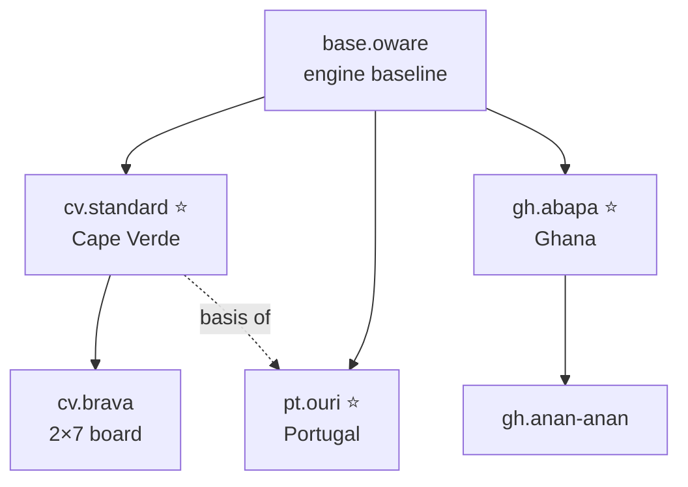

# Oware variants

> Variants grouped by country, with one default per country, and the rule parameters that tell them apart. **Status:** Draft. See [ADR 0012](../../decisions/0012-variants-by-country.md).

Long-term, Ouril supports **every Oware variant played worldwide**. Variants are grouped by **country**. Each country has one **default variant** and any number of **regional variants** (island, city or community rules). All of them are configurations of the same [rules engine](../../architecture/engine.md).

⭐ = default for the country.

## How variants are organized

- **ID:** `<country>.<variant>`, where the country is the lowercase ISO 3166-1 alpha-2 code (`cv.standard`, `cv.brava`, `gh.abapa`). The ID never changes once games have been played with it.
- **Country default:** exactly one variant per country has `default_for_country: true`. It's preselected when a player picks that country. The MVP ships `cv.standard`.
- **Inheritance:** a variant declares `extends: <id>` and overrides only what differs. A regional variant usually extends its country default, and a country default extends `base.oware`. The build resolves every variant into a complete config.
- **Spec files:** each variant has a spec at `docs/game/variants/<country-name>/<variant>.md`. It holds machine-readable YAML front matter (the config, sources, confidence) and the evidence for each rule. Specs are produced with the [`variant-research` skill](../../../.claude/skills/variant-research/SKILL.md).
- **In the app:** the player picks a country (defaulting to their own), then a variant (defaulting to the country's default). Variant names are localized.

## Rule parameters

These are the fields of the engine's `VariantConfig`. This list is the **single source of truth** for spec files and the engine. When research finds a rule that doesn't fit, it gets flagged and a parameter is added here.

| Parameter | Values | `base.oware` |
|---|---|---|
| `pits_per_side` | integer | `6` |
| `seeds_per_pit` | integer | `4` |
| `direction` | `ccw` \| `cw` | `ccw` |
| `skip_origin_on_lap` | bool | `true` |
| `single_seed_rule` | `allowed` \| `only_if_no_larger_pit` | `allowed` |
| `capture_counts` | list of integers | `[2, 3]` |
| `capture_mandatory` | bool | `true` |
| `chain_capture` | `backward` \| `none` | `backward` |
| `grand_slam` | `allowed_no_capture` \| `forbidden` \| `captures_all` \| `captures_all_extra_turn_must_feed` \| `loses` | `allowed_no_capture` |
| `must_feed` | bool | `true` |
| `feeding_overrides_single_seed_rule` | bool | `true` |
| `no_feed_outcome` | `mover_takes_own_side` \| `remaining_not_scored` \| `each_takes_own_side` | `mover_takes_own_side` |
| `win_threshold` | integer | `25` (more than half of the seeds) |
| `endless_cycle_outcome` | `each_takes_own_side` \| `remaining_not_scored` \| `draw` | `each_takes_own_side` |
| `endless_cycle_move_limit` | integer: moves in a row without a capture before the cycle rule applies (a repeated position also triggers it) | `100` |
| `first_player` | `random` \| `loser_starts_next` | `random` |
| `match_scoring` | optional, for example `{ big_win_threshold: 36, big_win_points: 2 }` | none |
| `relay_sowing` | `none` \| `own_side_occupied`: when the last seed of a lap lands in an occupied pit on the mover's own side, pick up its seeds and keep sowing ([ADR 0023](../../decisions/0023-relay-sowing.md)) | `none` |
| `capture_mode` | `opponent_side` \| `across_from_empty_own_pit`: capture from the pit across an empty own pit where the last seed lands, with `chain_capture` going back through own pits ([ADR 0024](../../decisions/0024-capture-across.md)) | `opponent_side` |

## Catalog

**Status:** `researched` (has a spec file) · `lead` (known to exist, not yet researched) · `implemented` (in the engine with test vectors).

| Country | Variant ID | Name | Default | Status | Spec |
|---|---|---|---|---|---|
| 🇨🇻 Cape Verde | `cv.standard` | Ouril (standard) | ⭐ | researched | [cape-verde/standard.md](cape-verde/standard.md) |
| 🇨🇻 Cape Verde | `cv.brava` | Ouril of Brava (2×7 board) | | lead | |
| 🇨🇻 Cape Verde | `cv.sao-vicente` | Uril of São Vicente | | lead | |
| 🇨🇻 Cape Verde | `cv.continuous` | Ouril with continuous sowing (relay sowing; reported as a family rule from Santiago) | | implemented | [cape-verde/continuous.md](cape-verde/continuous.md) |
| 🇨🇻 Cape Verde | `cv.across` | Ouril with capture across (a family rule) | | implemented | [cape-verde/across.md](cape-verde/across.md) |
| 🇨🇻 Cape Verde | `cv.across-continuous` | Ouril with capture across and continuous sowing (a family rule) | | implemented | [cape-verde/across-continuous.md](cape-verde/across-continuous.md) |
| 🇵🇹 Portugal | `pt.ouri` | Ouri (school and competition rules, derived from Cape Verde) | ⭐ | lead | |
| 🇸🇹 São Tomé and Príncipe | `st.ouri` | Ouri | ⭐ | lead | |
| 🇬🇭 Ghana | `gh.abapa` | Abapa (international tournament standard) | ⭐ | lead | |
| 🇬🇭 Ghana | `gh.anan-anan` | Anan-anan / Nam-nam | | lead | |
| 🇨🇮 Côte d'Ivoire | `ci.awale` | Awalé | ⭐ | lead | |
| 🇳🇬 Nigeria | `ng.ayo` | Ayo | ⭐ | lead | |
| 🇸🇳 Senegal | `sn.wori` | Wori / Wari | ⭐ | lead | |
| 🇦🇬 Antigua and Barbuda | `ag.warri` | Warri | ⭐ | lead | |
| 🇧🇧 Barbados | `bb.warri` | Warri | ⭐ | lead | |

The defaults for countries that haven't been researched are **provisional**. Research confirms or changes them.

## Adding a variant

1. Run the `variant-research` skill with a country or variant name. It writes or updates the spec file and this catalog.
2. Review the open questions in the spec. Ask players from that community when the sources disagree, and check open [rule or variant reports](https://github.com/Alfredo-Moreira/Ouril/issues?q=label%3Avariant).
3. Implement it: add the resolved config and test vectors in `core/`, then set the status to `implemented`.

## Open questions

- Should rated online play be available for every variant, or only country defaults? Many small rating pools would be thin.
- Do any variants need mechanics the parameters can't express (captures during sowing in Anan-anan; multi-round pit loss)? Relay sowing is now a parameter (`relay_sowing`, for [cv.continuous](cape-verde/continuous.md)); other relay styles (stop on any empty pit, relay on either side) would be new values. If so, the engine needs per-variant rule hooks, not just more flags.
