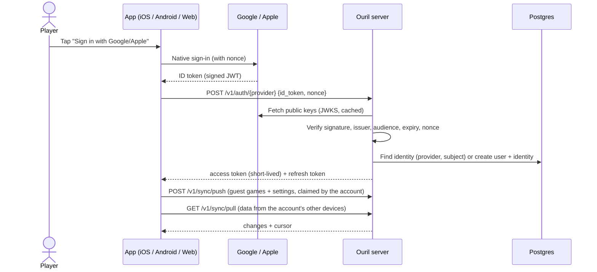

# Accounts and sign-in

> How players create accounts and sign in. **Status:** Accepted. See [ADR 0009](../../decisions/0009-oauth-accounts-google-apple.md).

## Why accounts before multiplayer

> **Timing:** accounts were planned for the MVP; they're built but switched off, and ship after the web MVP ([ADR 0025](../../decisions/0025-web-first-static-mvp.md)). The design below is unchanged.

The MVP is a single-player game, but online play (real-time and async against other people) is next. Shipping accounts before multiplayer means:

- players already have an identity when multiplayer launches, so there's no migration and no "create an account now" wall
- stats and history are backed up and follow the player across devices
- the auth part of the server is built and battle-tested early

## Principles

- **Signing in is optional, and guests never need the network.** Anyone can play vs AI right away, offline, as a **guest**. A guest makes no server calls at all, and no network requests unless they opted into telemetry ([ADR 0014](../../decisions/0014-telemetry-consent.md)). Signing in is offered (never forced) from the menu, the stats screen, and later when trying to play online.
- **No passwords.** We only use OAuth / OpenID Connect providers.
- **We own the account.** A provider login is an *identity linked* to our own user ID, so players can add or change providers without losing their account.
- **Collect the minimum:** provider subject ID, display name, and email if given. Never contacts or friends lists.

## Providers

| Provider | When | Platforms | Notes |
|---|---|---|---|
| **Google** | MVP | iOS, Android, Web | Android uses Credential Manager ("Sign in with Google"). iOS uses the Google Sign-In SDK. Web uses Google Identity Services. |
| **Apple** | MVP | iOS, Web (Android optional) | **Required on iOS** by App Store guideline 4.8 when a third-party login is offered. iOS uses AuthenticationServices; web uses Sign in with Apple JS. |
| **X (Twitter)** | Future | All | OAuth 2.0 with PKCE. May not return an email, so accounts must not depend on email. |
| **Meta (Facebook)** | Future | All | Facebook Login. On iOS, Apple sign-in already satisfies guideline 4.8. |

## Sign-in flow

- The **server** verifies every ID token. The app never decides who the user is.
- Our session = a short-lived **access token** (JWT, ~15 minutes) + a **refresh token** that is rotated on each use and stored hashed on the server.
- Tokens are stored in the **Keychain** (iOS), **Android Keystore**-backed storage, and an **httpOnly secure cookie** on the web.
- Signed-in players still play offline. Stats sync the next time the device is online.
- **Local development:** debug builds use a development identity provider (`POST /v1/auth/dev`) to sign in as seeded test users without Google or Apple. It's never compiled into release builds ([ADR 0017](../../decisions/0017-local-first-development.md)).

## Guest → account

- On first launch the app creates a local **guest profile**: a random ID, with stats and history stored on the device.
- When the guest signs in, their local game records are claimed by the account and synced. If the account already has data from another device, the game histories are **combined** (by game ID), and stats are recomputed from the combined history. No counters are merged, so nothing is double-counted.
- Signing out keeps the local data on the device but stops syncing.
- Full details: [data and sync](../../architecture/data-and-sync.md).

## Profile

- **Display name:** pre-filled from the provider, editable.
- **Handle** (unique, for example `@mindelo_master`): chosen at sign-up, needed later for friend invites and challenges.
- **Avatar:** from the provider or a default, changeable later.
- **Locale and country:** suggested from the device. Country is optional and will be used later for leaderboards.

## Account deletion and privacy

- **In-app account deletion** is required by Apple (guideline 5.1.1(v)) and Google Play. Google Play also requires a **web page** where users can request deletion.
- Deletion removes personal data, revokes all sessions, and **revokes the Sign in with Apple token** through Apple's REST API. Past online games keep an anonymized "Deleted player" entry so opponents' history stays intact.
- How revocation works: at Apple sign-in the app also sends the `authorization_code`; the server exchanges it for Apple's refresh token (client secret signed with the `.p8` key), keeps it only for this, and revokes it on account deletion. Apple sign-in stays off if the key can't be loaded, so no Apple account is ever created that couldn't be revoked.
- A **privacy policy** is required by both stores before launch.
- Apple only sends the user's name on the **first** sign-in, so it must be saved then.
- Apple users may hide their email behind a relay address. We treat email as optional everywhere.

## Edge cases

- **Same person, two providers** (signed up with Google, later taps Apple): this creates a separate account unless they link providers from settings. Linking is post-MVP; automatic merging by email is **not** done because it isn't safe.
- **Provider account removed or revoked:** sessions stay valid until expiry. Apple sends server-to-server notifications for revocations, which we handle.
- **Server down:** sign-in fails gracefully. The game stays fully playable as a guest or a signed-in offline player.

## Open questions

- Handle rules: length, allowed characters, reserved words, and how often it can be changed.
- Offer Apple sign-in on Android too, or only on iOS and web?
- Minimum age and parental consent (COPPA/GDPR-K) if children play.
