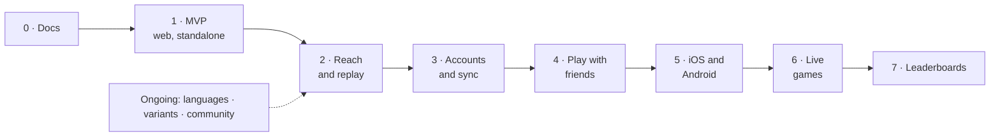

# Roadmap

> Phased plan from documentation to a global competitive game. **Status:** Draft

Each phase ships something usable. The order may change, but every phase depends on the ones before it.

## Phase 0: Documentation ✅ *(done)*
- Vision, rules, MVP, roadmap, architecture and ADRs (this folder).
- ✅ Tech stack decided: Rust core, native apps, Rust server ([ADRs](../decisions/README.md)).
- ✅ Accounts decided: optional Google and Apple sign-in ([accounts](features/accounts.md)).
- ✅ Cape Verdean rules researched ([spec](../game/variants/cape-verde/standard.md)). Community confirmation of a few points is welcome but doesn't block coding.
- ✅ Variants by country with a default per country, plus the `variant-research` skill.
- ✅ Cape Verde app decisions for points no source covers. ✅ Setup decisions: bindings, translations format, local-first development, build order (ADRs 0015–0018).

## Phase 1: MVP on the web *(ready to launch)*
See [mvp.md](mvp.md) and [ADR 0025](../decisions/0025-web-first-static-mvp.md): the web app alone, as a static site with no server.
- ✅ Local-first development ([ADR 0017](../decisions/0017-local-first-development.md)): `compose.yaml`, the `toolbox` image, `justfile`, Dev Container, and CI (`.github/workflows/`).
- ✅ Rust core: engine, AI, stats (`core/sync`), API types (`core/protocol`) and WASM bindings ([API](../../core/wasm/API.md)). Four Cape Verdean rule sets with test vectors and property tests: `cv.standard`, `cv.continuous`, `cv.across`, `cv.across-continuous`.
- ✅ **Web** (`apps/web`): play vs AI (3 levels), 3D board with a hand, tutorial, rules per variant, forfeit and resume, game music, landing and About pages, offline PWA, English with every string translatable.
- ✅ Deploy pipeline to Vercel ([deployment](../architecture/deployment.md)). ⏳ Vercel project, secrets and domain.
- Built but switched off for the MVP: sign-in, sync, Stats and replays, and the server (`apps/server`, [API](../../apps/server/API.md)) on Postgres. Google and Apple sign-in answer `501 not_configured` until keys exist.

Phases 2 to 7 ship in this order (agreed after the MVP). The three "coming soon" items on the home page are phases 3, 4 and 7.

## Phase 2: Reach and replay
No server needed: the app stays a static site.
- **Pass-and-play:** two players on one device.
- **Share a finished game** as a link or image.
- **Crash reporting** (Sentry), opt-in through the consent prompt ([ADR 0014](../decisions/0014-telemetry-consent.md)), which appears once it's configured.

## Phase 3: Accounts and sync
Switch on what's already built ([accounts](features/accounts.md), [backend](../architecture/backend.md)): host the server and database ([ADR 0019](../decisions/0019-host-server-on-fly-io.md)), set up Google and Apple client IDs, and publish a privacy policy.
- Optional sign-in with Google and Apple; guests stay fully offline.
- Backup and sync of game history and settings across devices.
- Stats, history and replays (`VITE_FEATURE_ACCOUNTS`, `VITE_FEATURE_STATS`).

## Phase 4: Play with friends (async)
Online play against real people, turn by turn. Requires sign-in.
- Invite a friend by handle or link, or accept an open challenge.
- Many games at once, turn deadlines (for example 3 days), and a notification when it's your turn (web push).
- Friends list.
- See [multiplayer.md](features/multiplayer.md).

## Phase 5: iOS and Android
Native apps (SwiftUI, then Jetpack Compose; [ADR 0008](../decisions/0008-native-apps-per-platform.md)) with the same Rust core through UniFFI. They launch with everything above: play vs AI, accounts and sync, and games with friends, with native push notifications. Until then the installable web app covers phones.

## Phase 6: Live games
- Real-time matches over WebSocket, with server-owned clocks (for example 5 or 10 minutes).
- **Matchmaking** by skill, plus direct challenges.
- Reconnection handling, resign, draw offers, and rematch.
- Rated and casual modes.

## Phase 7: Leaderboards
- **Skill rating** (Glicko-2) from rated online games.
- **Points board** from activity and wins. Wins against the computer are played on the device and can't be verified, so they count for little or nothing.
- **Scopes:** global, country, region/state, and city.
- Seasons with periodic resets of the points board.
- See [leaderboards.md](features/leaderboards.md).

## Ongoing (not tied to a phase)
- **Languages:** Portuguese, Cape Verdean Kriolu and more, each shipped as soon as a native-speaking translator has reviewed it ([localization.md](features/localization.md)). Every string is already translatable.
- **More variants:** variants by country, each with its default ([catalog](../game/variants/README.md)), for example Brava's 2×7 board or Ghana's Abapa, added as they're researched with the `variant-research` skill. The variant picker lets players choose a country, then a variant.
- **Community and beyond (ideas):** X (Twitter) and Meta (Facebook) sign-in and linking several providers, tournaments and events, puzzles and daily challenges, spectating and game analysis, clubs and teams (for example by island or city), Spotify for game music, and a monetization review (cosmetic boards and seeds?) that keeps the game fair and free to play.

## Open questions
- Should X/Meta sign-in come earlier (for example with multiplayer, to help players invite friends)?
