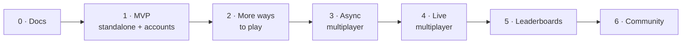

# Roadmap

> Phased plan from documentation to a global competitive game. **Status:** Draft

Each phase ships something usable. The order may change, but every phase depends on the ones before it.

## Phase 0: Documentation ✅ *(done)*
- Vision, rules, MVP, roadmap, architecture and ADRs (this folder).
- ✅ Tech stack decided: Rust core, native apps, Rust server ([ADRs](../decisions/README.md)).
- ✅ Accounts decided: optional Google and Apple sign-in ([accounts](features/accounts.md)).
- ✅ Cape Verdean rules researched ([spec](../game/variants/cape-verde/standard.md)). Community confirmation of a few points is welcome but doesn't block coding.
- ✅ Variants by country with a default per country, plus the `variant-research` skill.
- ✅ Cape Verde app decisions for points no source covers. ✅ Setup decisions: bindings, translations format, local-first development, build order (ADRs 0015–0018).

## Phase 1: MVP (standalone + accounts) *(current)*
See [mvp.md](mvp.md).
- Local-first development ([ADR 0017](../decisions/0017-local-first-development.md)). Build order core → web → iOS → Android, launching together ([ADR 0018](../decisions/0018-platform-build-order.md)).
- Monorepo, Rust core (engine + AI) with shared test vectors, and bindings for Swift, Kotlin and WASM.
- Native apps: play vs AI (3 levels), tutorial and rules screen, local stats and history.
- **Optional sign-in with Google and Apple.** Guests never need the network. Signed-in players get offline-first sync of history and settings. First version of the server (auth, profile, sync) on Postgres.
- Release on web, iOS and Android.

## Phase 2: More ways to play
- **Pass-and-play:** two players on one device.
- **More variants:** variants by country, each with its default ([catalog](../game/variants/README.md)). Cape Verdean regional variants (for example Brava's 2×7 board) and other countries' defaults (for example Ghana's Abapa) are added as they are researched with the `variant-research` skill. The variant picker lets players choose a country, then a variant.
- **Localization:** Portuguese and Cape Verdean Kriolu ([localization.md](features/localization.md)).
- Game replays, and sharing a finished game as a link or image.

## Phase 3: Async multiplayer
Online play against real people, turn-by-turn. Requires sign-in.
- Invite a friend by handle or link, or accept an open challenge.
- Many games at once, with a push notification when it's your turn and turn deadlines (for example 3 days).
- Friends list.
- See [multiplayer.md](features/multiplayer.md).

## Phase 4: Live (sync) multiplayer
- Real-time matches over WebSocket, with server-owned clocks (for example 5 or 10 minutes).
- **Matchmaking** by skill, plus direct challenges.
- Reconnection handling, resign, draw offers, and rematch.
- Rated and casual modes.

## Phase 5: Leaderboards
- **Skill rating** (Glicko-2) from rated games.
- **Points board** from activity and wins, including wins vs AI.
- **Scopes:** global, country, region/state, and city.
- Seasons with periodic resets of the points board.
- See [leaderboards.md](features/leaderboards.md).

## Phase 6: Community and beyond (ideas)
- **More sign-in providers: X (Twitter) and Meta (Facebook)**, plus linking several providers to one account.
- Tournaments and events.
- Puzzles ("capture the most in one move") and daily challenges.
- Spectating and game analysis.
- Clubs and teams (for example by island or city).
- More languages.
- Monetization review (cosmetic boards and seeds?), keeping the game fair and free to play.

## Open questions
- Should async multiplayer come before live multiplayer (as planned) or the other way around?
- Should X/Meta sign-in come earlier (for example with multiplayer, to help players invite friends)?
